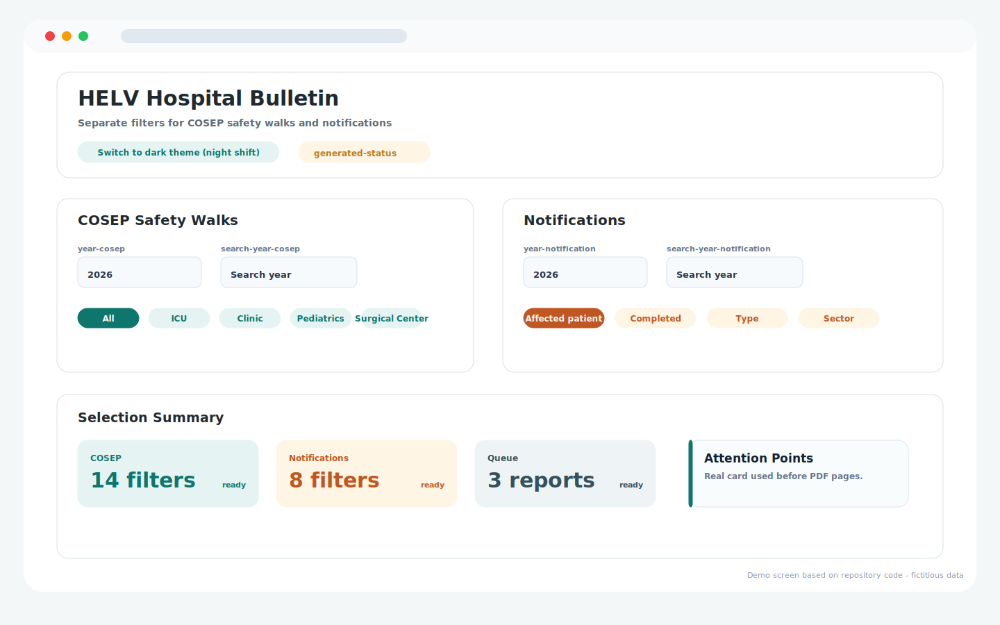
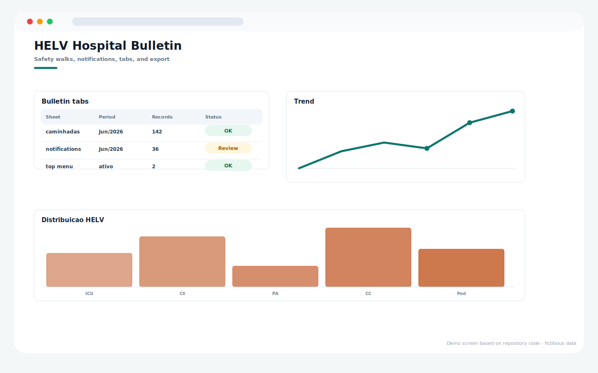
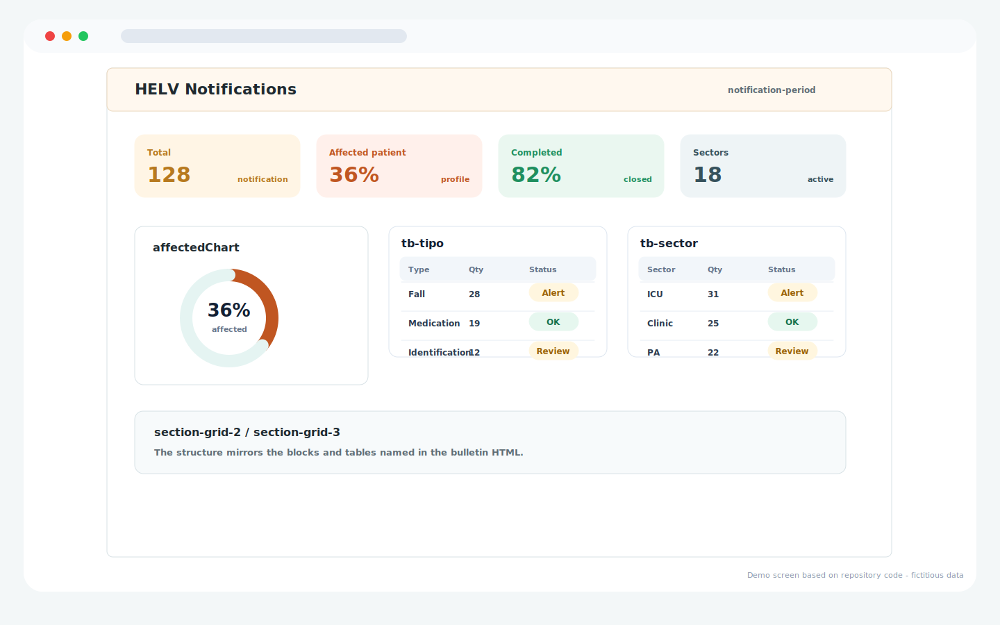

# HELV Hospital Bulletin

Repository: `HELV_BOLETIM`

## Overview

Hospital bulletin dashboard for HELV indicators, filters, pages, notifications, tabs, and report export.

## Main Capabilities

- Filter and summary surface for bulletin generation.
- Separate bulletin pages for safety walks and notifications.
- Trend and distribution views for hospital reporting.

## Operating Flow

1. Select the reporting filters.
2. Review the generated summary and report pages.
3. Use the notification page to inspect event distribution.
4. Export or present the institutional bulletin.

## Visual System Guide

> The screens below are documentation mockups based on the components, labels, colors, and workflows found in this repository. All displayed data is fictitious and does not represent real patients, staff members, or institutions.

### HELV - filters and summary

### HELV - pages and indicators

### HELV - notifications

## Data Privacy

The repository documentation and guide images use fictitious sample data only.

## Technologies

- JavaScript
- HTML/CSS
- Google Apps Script
- Google Sheets

## Status

Completed
